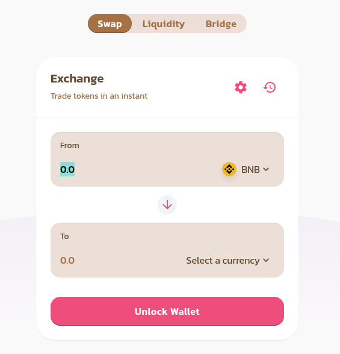

# Exchange

\*\*\*\*[**Token swaps**](https://exchange.visiondefi.io/#/swap) on VisionDefi's exchange are a simple way to trade one BEP-20 token for another via automated liquidity pools.

The liquidity provided to the exchange comes from Liquidity Providers \("LPs"\) who stake their tokens in "Pools". In exchange, they get LP tokens, which can also be staked to earn VISION tokens in the "farm".

